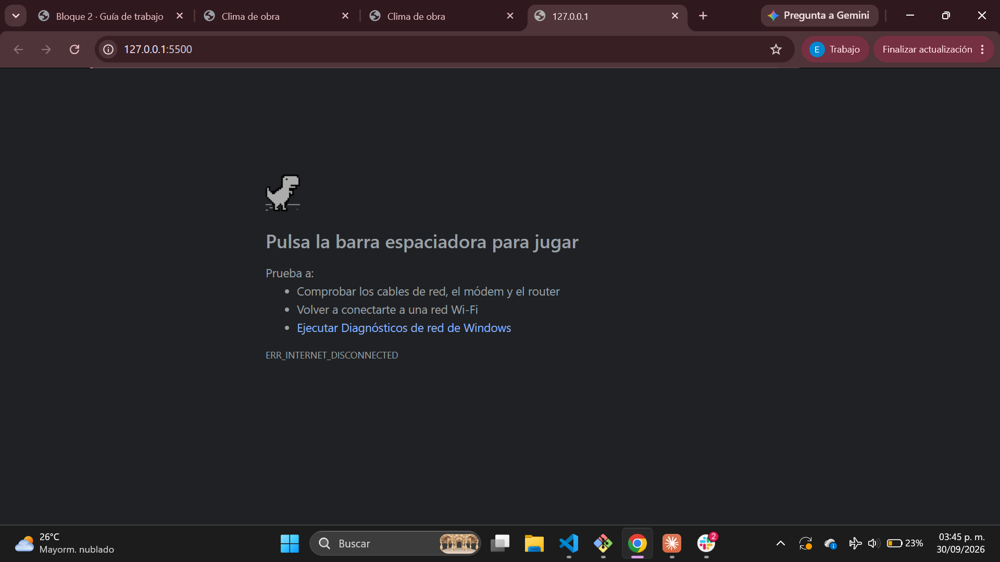

# PREGUNTAS

**1 ¿Qué es un servidor y dónde está físicamente?

>Un servidor es el que hace todo depende lo q se le pida, esta situado en cualquier computadora existente la cual obviamente asignes como servidor.

**2 ¿Qué es un dominio y qué es DNS? (La versión corta: cómo tu computadora averigua a qué servidor le tiene que hablar.)

>El dominio es el nombre que se le asgina a una pagina web y el DNS es la direccion del servidor.

**3 ¿Qué es una petición HTTP y qué trae la respuesta?

>Es un mensaje para pedir informacion a un servidor, la respuesta tiene toda es informacion dentro.

**4 ¿Qué significan los códigos 200, 301, 404 y 500?

>200 todo salio bien, 301 la pagina cambio de direccion, 404 no se encontro la pagina y 500 hubo un error en el servidor.

**5 ¿Qué hace el navegador cuando le llega un archivo HTML?

>Lo lee y lo transforma a una pagina que se pude ver.

# TABLA

| wikipedia | cucei.udg.mx | Amazon |
|---------|----------|------------|
| 120 RQ | 188 RQ | 137 RQ |
| 10 archivos con imagen | 48 archivos con imagen | 22 archivos con imagen |
| 38 java | 94 java | 50 java |
| 25 (ping204), 1 (textplani204), 1 (textht302), 2 (textcss204), 1 (sodar204). | 4 (script404), 3 (script/301), 2 (stylehs404), 3 (xhr404). | 1 (sodar204), 12 (ping204), 1 (prefetch202), 3 (texthtml204), 1 (texthtml302), 1 (textplain204). |

# QUE INDICA CADA UNA 

<!DOCTYPE> → Dice que es HTML5
<html>     → Página completa
<head>     → Información de la página
<meta>     → Configuración
<title>    → Nombre de la pestaña
<link>     → Conecta CSS
<body>     → Lo que se ve
<header>   → Encabezado
<main>     → Contenido principal
<section>  → Divide el contenido
<h1>       → Título principal
<h2>       → Subtítulo

        → Texto
<script>   → JavaScripT

### PREGUNTA
 1** ¿qué es lo que hace el atributo id? ¿Por qué el <script> está hasta abajo y no en el <head>?
 
 >id sirve para darle un nombre unico a las cosas o elementos y <script> primero carga el HTML y despues JAVASCRIPT.

 ### ejercicio parte 6

1** ¿Qué te responde?

> {"reason":"Parameter 'latitude' and 'longitude' must have the same number of elements","error":true}

2** ¿Qué código de estado sale en la pestaña Network?

> Coloca el codigo de error 400.

# Forma del JSON de Open-Meteo

RAÍZ
├── latitude
├── longitude
├── generationtime_ms
├── utc_offset_seconds
├── timezone
├── timezone_abbreviation
├── elevation
├── current_units
│   ├── time
│   ├── interval
│   ├── temperature_2m
│   ├── relative_humidity_2m
│   ├── precipitation
│   └── wind_speed_10m
└── current
    ├── time
    ├── interval
    ├── temperature_2m
    ├── relative_humidity_2m
    ├── precipitation
    └── wind_speed_10m

# Rutas con punto

datos.current.temperature_2m        →  22.7
datos.current_units.temperature_2m  →  "°C"

datos.latitude                         →  21.03829
datos.longitude                        →  -105.25024
datos.generationtime_ms                →  0.058650970458984375
datos.utc_offset_seconds               →  -25200
datos.timezone                         →  "America/Mazatlan"
datos.timezone_abbreviation            →  "MST"
datos.elevation                        →  3.0

datos.current_units.time               →  "iso8601"
datos.current_units.interval           →  "seconds"
datos.current_units.temperature_2m     →  "°C"
datos.current_units.relative_humidity_2m →  "%"
datos.current_units.precipitation      →  "mm"
datos.current_units.wind_speed_10m     →  "km/h"

datos.current.time                     →  "2026-09-28T22:30"
datos.current.interval                 →  900
datos.current.temperature_2m           →  22.7
datos.current.relative_humidity_2m     →  0
datos.current.precipitation            →  0
datos.current.wind_speed_10m           →  5.5

# ERRORES PARTE 8

### ¿Qué aparece en la página? ¿Hay error en la consola o no? ¿Por qué?

> Temperatura: undefined °C, no, no hay error en la consola, porque solo sale como un error indefinido.

## Error id

> Uncaught (in promise) TypeError: Cannot set properties of null (setting 'textContent')

## Errores con MATEO

> 1** ailed to load resource: net::ERR_NAME_NOT_RESOLVED

> 2** rror: TypeError: Failed to fetch at cargarClima (app.js:6:29)

## Sin internet 

> En esta evidencia se muestra el comportamiento de la página cuando el sitio carga correctamente, pero la API del clima no responde debido a la falta de conexión a Internet. Los elementos de la página permanecen visibles y los datos del clima quedan en estado “Cargando…”, permitiendo comprobar la importancia de utilizar try/catch para manejar correctamente los errores y evitar que la aplicación quede esperando indefinidamente.

> 

## Línea de error " ) "

> Uncaught SyntaxError: Unexpected token ')' 

## try y catch 

> try...catch en JavaScript es la estructura diseñada para manejar errores de forma controlada y evitar que la aplicación se congele o se rompa por completo. Cuando una operación falla (por ejemplo, una API de clima no responde o hay un error de red), el bloque try detiene su ejecución inmediatamente y transfiere el control al bloque catch, permitiéndote actualizar la interfaz de usuario con un mensaje claro en lugar de dejar un indicador de «Cargando...» de forma indefinida.
